# Field Stats

The Field Stats Plugin allows you calculate basic statistics and create a histogram and boxplot for numeric fields in vector layers.

Your QGIS installation must have [pandas](https://pandas.pydata.org/) and [matplotlib](https://matplotlib.org/)

## How to install
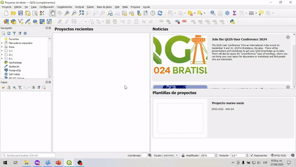

The next images show you how to install
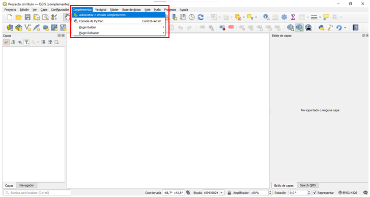
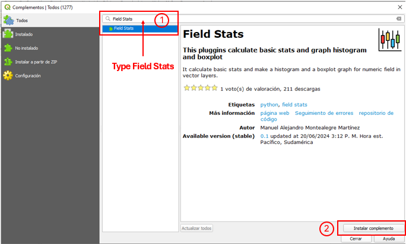
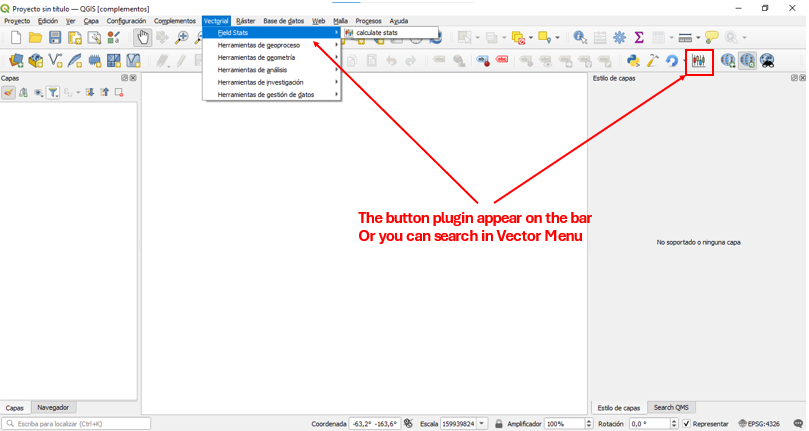

## How to use
Field Stats can make the stats and graph for all features or only selected features and you can round the statistics to desire decimal

All Features

Selected Features

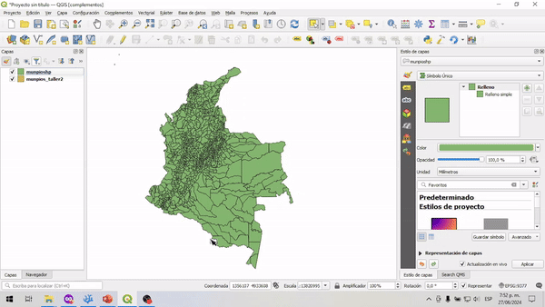

Next image resume how to use

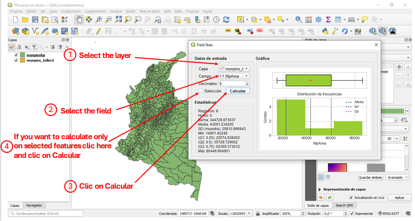

## How to install Pandas and matplotlib library in Windows
Your QGIS installation must have [pandas](https://pandas.pydata.org/) and [matplotlib](https://matplotlib.org/), in Windows with the OSGeo installer follow the next steps if don't have the libraries.

Search the OSGeo4W in windows menu and select Setup option

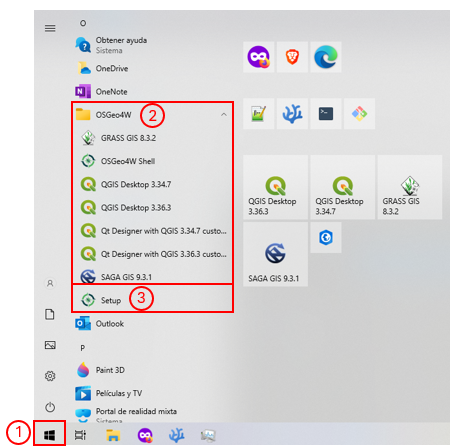

Select advanced install and clic in next (siguiente)

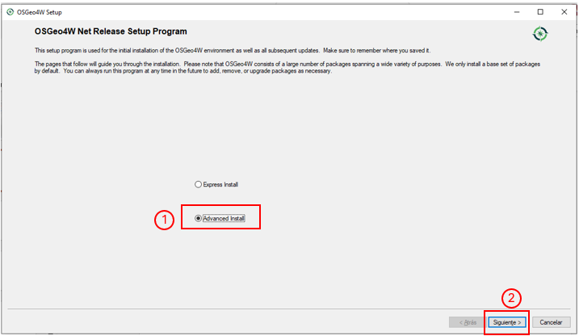

Select intall from internet and clic in next (siguiente)

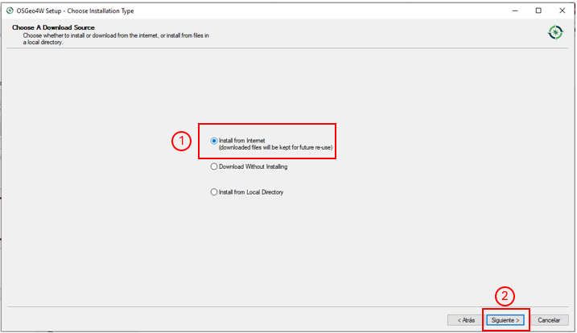

Select your root directory, most of the time it set correct root and you don't have to change, it correspond to first installation of QGIS

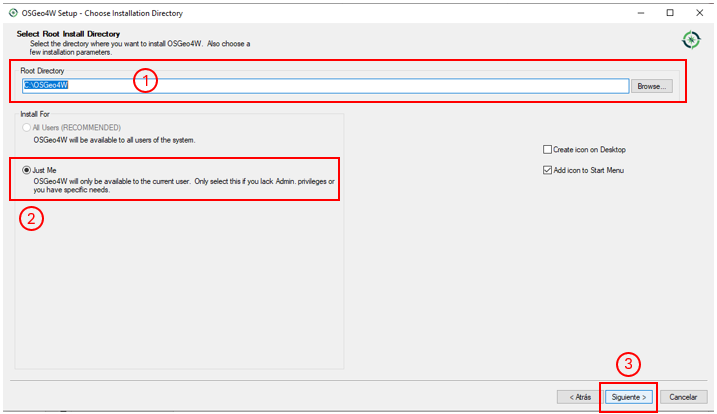

Select your package directory, most of the time it set correct, and you don't have to change, it correspond to first installation of QGIS

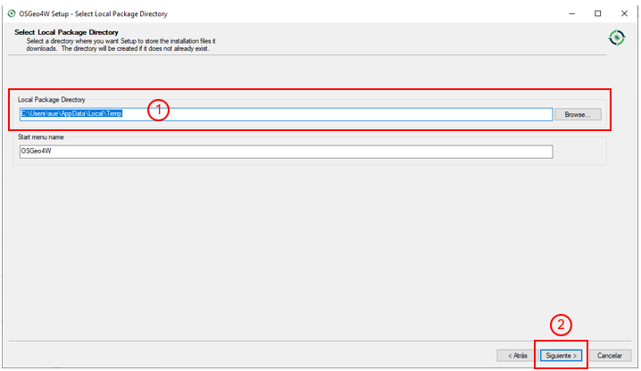

Select Use System Proxy Settings and clic in next (siguiente)

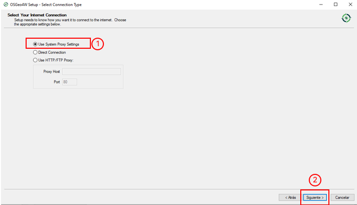

Select the first option to download the packages from that URL and clic next (siguiente)

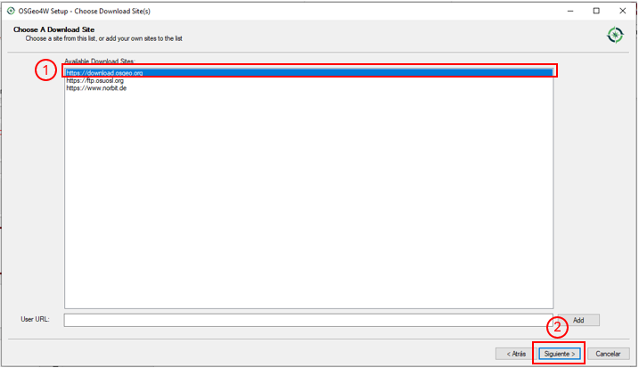

Type Pandas or Matplolib, to install the library, when you don't have the library it appears like `Source`, clic in `Source` to change for `Install`, If you already installed you see `Keep`

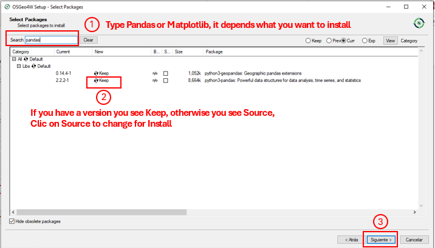

Wait to installation to finish and clic on `Finish`
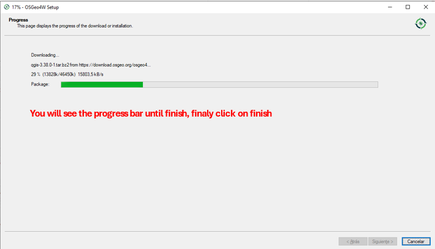

If you are using the plugin on MacOS or Linux install the libraries using `pip`, `conda` or `mamba` command, its on your hands. Better if you have installed QGIS into an virtual env.

